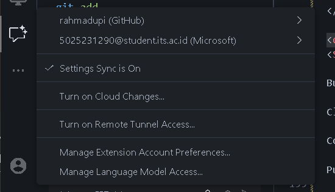
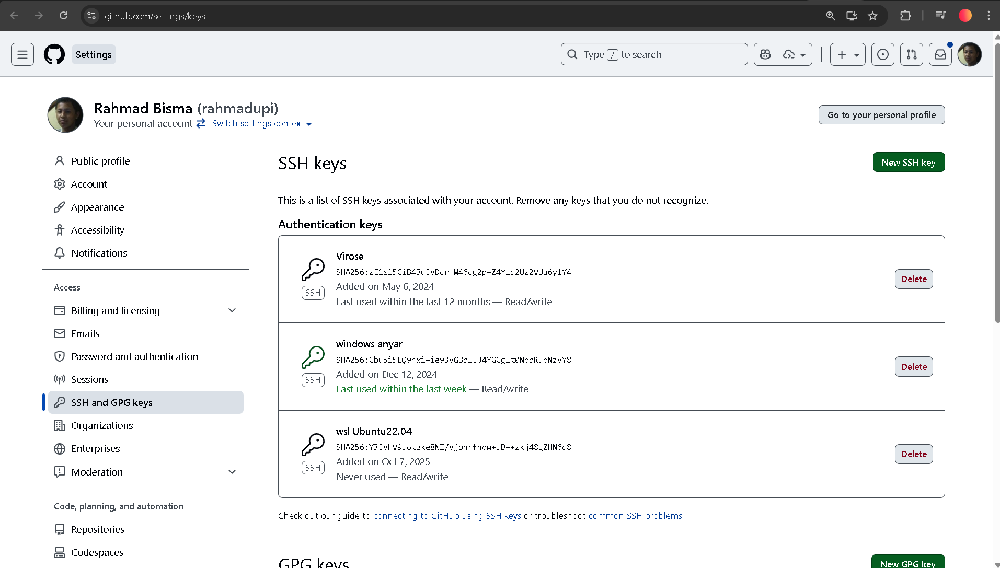
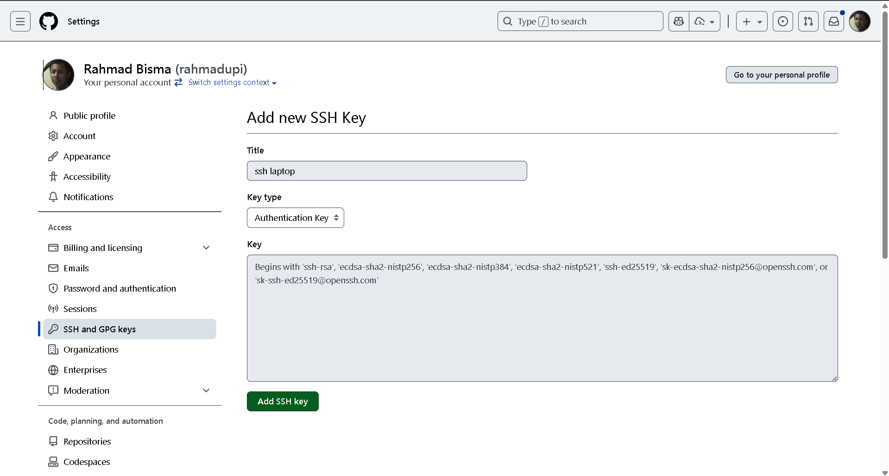
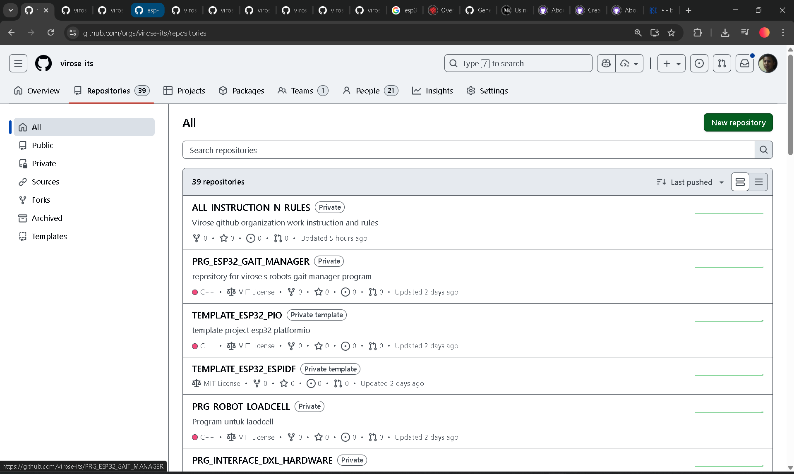
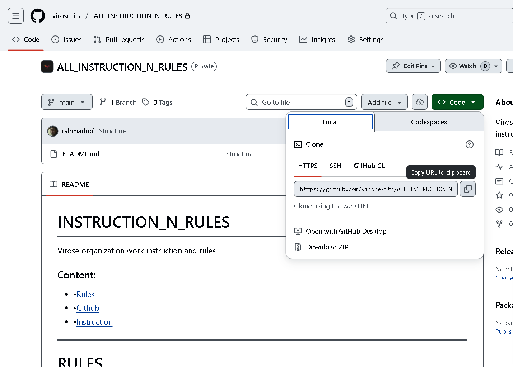
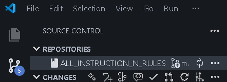
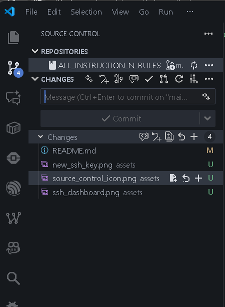

<h1 style="text-align:center;"><b>INSTRUCTION_N_RULES</b></h1>

Virose organization work instruction and rules

<h3 style="text-align:center; margin: 5px 0;
"> Content: </h3>
<ul style="display: flex; padding: 0; gap: 10px; justify-content: center; 
list-style-type: none;">
  <li >
    •<a href="#rules-section">Rules</a>
  </li>
  <li>
    •<a href="#github-section">Github</a>
  </li>
  <li>
    •<a href="#instruction-section">Instruction</a>
  </li>
</ul>

---

<!-- RULES -->

<h1 style="text-align:center;" id="rules-section">
    <b>RULES</b>
</h1>

 GENERAL

<b>Struktur penamaan repository:</b> 
<code>
[DIVISI]_[TAG DIVISI]_[NAMA]_[KETERANGAN(optional)]
</code>

 <b>Aturan penamaan repository:</b> 
1. Gunakan nama yang deskriptif dan singkat. 
2. TAG DIVISI disesuaikan dengan divisi masing-masing. 
3. Gunakan underscore (_) untuk memisahkan kata. 

Contoh: 
PRG_ROBOT_SUB_PROGRAM 

DIVISI 
PRG: Programming 
MCH: Mechanic 
ELC: Electrical 

<b>Aturan Commit</b>: 
[ACTION]_[KETERANGAN]    
1. Gunakan bahasa Inggris atau Indonesia yang jelas dan singkat. 

Action: 

- ADD: untuk penambahan fitur atau file baru 
- FIX: untuk perbaikan bug atau kesalahan 
- CHORE: Minor addition
- REMOVE: untuk penghapusan fitur atau file 
- REFACTOR: untuk perubahan struktur kode tanpa mengubah fungsionalitas 
- DOC: untuk perubahan pada dokumentasi 

 

 PROGRAMMING

<b>TAG DIVISI:</b>
<ul>
<li>ROBOT: untuk program robot utama </li>
<li>SUB: untuk program pendukung robot</li>
<li>TOOLS: untuk program alat bantu</li>
<li>WEB: untuk program website</li>
<li>INTERFACE: untuk program interface robot</li>
<li>ESP32/ARDUINO: untuk program microcontroller ESP32/Arduino</li>
<li>TEST: untuk repo testing</li>
</ul>

<b>ATURAN:</b>

<ul>
<li>Penugasan akan ditaruh notion</li>
<li>Buat branch baru buat setiap penugasan yang bersifat adding</li>
<li>Integrasi harus lewat PULL REQUEST dan menunggu code review</li>
</ul>

 

 MECHANIC

<b>TAG DIVISI:</b>
<ul>
<li>None </li>

</ul>

<b>ATURAN:</b>

<ul>
<li>None</li>
</ul>

 

 ELECTRICAL

<b>TAG DIVISI:</b>
<ul>
<li>None </li>

</ul>

<b>ATURAN:</b>

<ul>
<li>None</li>
</ul>

---

<!-- GITHUB -->
<h1 style="text-align:center;" id="github-section">
    <b>GITHUB</b>
</h1>

 BRANCH

branching gae feature

 RELEASE

Rilis fungsional

---

<!-- INSTRUCTION -->

<h1 style="text-align:center;" id="instruction-section">
    <b>INSTRUCTION</b>
</h1>

 PREQUISITES

<ol>
<li>Buat akun <a href="https://github.com/signup">Github</a></li>
<li>Install <a href="https://git-scm.com/downloads">Git</a></li>
<li>Install <a href="https://code.visualstudio.com/">Vscode</a> (optional tapi disarankan)</li>
</ol>

 SETUP

<h4><b>GIT</b></h4>
1. Buka terminal / command prompt 
2. Set username sama email git lewat terminal 

<pre>
git config --global user.name "username"
git config --global user.email "email@example.com"
</pre>

<h4><b>VSCODE</b></h4>
1. Login github di Vscode 

<h4><b>SSH</b></h4>
<ol>
  <li>Buka terminal / command prompt.</li>
  <li>Generate SSH key (jika belum ada):
    <pre>
ssh-keygen -t ed25519 -C "your_email@example.com"
    </pre>
    Tekan <kbd>Enter</kbd> untuk lokasi default, dan masukkan passphrase jika ingin.
  </li>
  <li>Cek file public key di <code>C:\Users\USERNAME\.ssh\id_ed25519.pub</code> (Windows) atau <code>~/.ssh/id_ed25519.pub</code> (Linux/Mac).</li>
  <li>Copy isi file public key:
    <pre>
cat ~/.ssh/id_ed25519.pub
    </pre>
    atau buka file tersebut dengan Notepad.
  </li>
  <li>Buka <a href="https://github.com/settings/keys">GitHub SSH Keys</a> dan klik <b>New SSH key</b>.
  
  </li>
  <li>Paste public key ke kolom yang disediakan, beri nama, lalu klik <b>Add SSH key</b>.
  
  </li>
  <li>Test koneksi:
  ketik perintah berikut di terminal:
    <pre>
ssh -T git@github.com
    </pre>
    Jika berhasil, akan muncul pesan "Hi username! You've successfully authenticated..."
  </li>
  <li>Sekarang bisa clone/push/pull repo dengan SSH, misal:
    <pre>
git clone git@github.com:username/repository.git
    </pre>
  </li>
</ol>

 HOW TO CONTRIBUTE

<h4><b>MEMBUAT REPOSITORY</b></h4>
Membuat Repository baru untuk bebas ngapain aja
<b>Instruksi:</b>
<ol>
<li>Login ke akun Github</li>
<li>Masuk tab <a href="https://github.com/orgs/virose-its/repositories">Repositories</a> di Virose Github Organization</li>
<li>Pilih new repository

<li>Isi form sesuai kebutuhan.

</li>
</li>
</ol>

<h4><b>CLONE REPOSITORY</b></h4>
<b>Instruksi:</b>
<ol>
<li> Buka folder yang mau diisi reponya di terminal/command prompt.</li>
<li> Ketik 
<pre>
git clone [link_repo_https]
</pre>
</li>
<li> Link repo bisa didapet di tab "Code" di halaman repository GitHub, pilih "HTTPS" dan salin linknya.

</li>
</ol>

<h4><b>CONTRIBUTING(COMMIT & PUSH)</b></h4>
<b>Pake terminal</b> 
<ol>
<li> Buka folder repo yang mau diCommit dan Push di terminal/command prompt.</li>
<li> Coba cek list perubahan yang ada pake
<pre>
git status
</pre>
</li>
<li> buat ngelist file yang mau diCommit pake
<pre>
git add [nama_file]

atau
git add .  (buat nambahin semua file yang berubah)
</pre>
</li>
<li> Buat melakuin commit pake
<pre>
git commit -m "pesan commit"
</pre>
</li>
<li> Buat push commit ke remote repo pake
<pre>
git push
atau
git push origin [nama_branch] (buat spesifik ke branch lain)
</pre>
</li>
</ol>

<b>Pake Source Control Vscode</b> 
<ol>
<li> Buka folder repo pake Vscode</li>
<li> Klik icon Source Control di sidebar

</li>
<li> Sebelum commit list dulu perubahan yang mau dicommit pake icon + di file yang ada perubahan  file yang ditekan + bakal ditandai atau staged buat masuk commit</li>
<li> Setelah itu ketik pesan commit di kolom atas terus klik icon centang buat commit

</li>
</ol>

